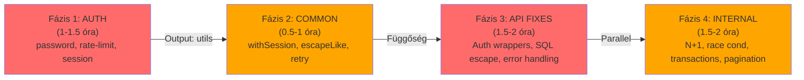

# 🔧 WWP-RENDSZER FIX PLAN - Modulonkénti bontás

**Készítve:** 2026-09-13  
**Prioritás:** Kritikus → Nagy → Közepes  
**Teljes munka:** 4-8 óra (MVP path)

---

## 📊 Modulok & Hibák - Függőségi mátrix

### 🔐 **AUTH Modul**
**Status:** Fejlesztés alatt | **Kritikus hibák:** 3

| # | Hiba | Súlyosság | Hatás | Munka | Függetlenség |
|----|------|----------|-------|-------|--------------|
| 1 | Session Secret validation hiányos | Kritikus | Runtime crash ha env missing | 30 perc | ✅ Teljesen független |
| 2 | Weak password policy (min 6 char) | Kritikus | Biztonsági kockázat | 30 perc | ✅ Független |
| 3 | Login rate-limiting hiányzik | Nagy | Brute-force attack lehetséges | 1 óra | ✅ Független |

**Összesen:** 2 óra | **Párhuzamosítható:** ✅ IGEN (mind egymástól független)

**Javasolt fix sorrend:**
```bash
# 1. Jelszó validáció (users-actions.ts)
lib/auth/password-validation.ts → users-actions.ts

# 2. Rate limiting wrapper (actions.ts)
lib/auth/rate-limit.ts → actions.ts

# 3. Session secret validation (session.ts)
lib/auth/session.ts
```

---

### 🚛 **FUVAROZÁS Modul**
**Status:** Élesben | **Hibák:** 3

| # | Hiba | Súlyosság | Hatás | Munka | Függetlenség |
|----|------|----------|-------|-------|--------------|
| 1 | API route-hoz nincs `requireSession()` | Kritikus | Adatszivárgás — bárki lekérdezheti összes fuvar adatot | 30 perc | ⚠️ Közös: `auth/require-session.ts` szükséges |
| 2 | LIKE SQL injection (kereses/route.ts) | Nagy | Pattern injection, DoS | 20 perc | ✅ Független (local escape helper) |
| 3 | Missing error handling (geocode, toll) | Nagy | Silent failures, hibás adatok | 1.5 óra | ✅ Független (local retry wrapper) |
| 4 | Expensive queries (subqueries) | Közepes | Performance (dev issue) | 1 óra | ✅ Független |

**Összesen:** 3 óra | **Párhuzamosítható:** ⚠️ Félleges (1. függ auth-tól, 2-3-4 független)

**Függőség:** 
- ❌ Az 1. nem javítható mindaddig, amíg az AUTH modul nem kapja meg a `requireSession()` wrapper-t
- ✅ A 2-3-4 azonnal javítható

**Javasolt fix sorrend:**
```bash
# ELŐBB: AUTH modul 1-3. fix
# AZTÁN:
# 1. API auth wrapper
lib/fuvarozas/../route.ts → withSession() + requireSession()

# 2. LIKE escape
lib/fuvarozas/sql-escape.ts + actions.ts:821

# 3. Retry wrapper
lib/external-api/retry.ts + actions.ts:426-470 (geocode, toll)

# 4. Query optimization
lib/fuvarozas/actions.ts:47-68 (optional, nem kritikus)
```

---

### 👥 **DOLGOZÓK Modul**
**Status:** Fejlesztés alatt | **Hibák:** 2

| # | Hiba | Súlyosság | Hatás | Munka | Függetlenség |
|----|------|----------|-------|-------|--------------|
| 1 | N+1 Query Problem (`isMonthFullyPaid()`) | Nagy | 21+ lekérdezés 1 helyett → havi processing lassú | 1 óra | ✅ Teljesen független |
| 2 | Race condition (pointer update) | Közepes | Párhuzamos requestek → inkonsz. állapot | 1 óra | ✅ Független |

**Összesen:** 2 óra | **Párhuzamosítható:** ✅ IGEN (egymástól független)

**Javasolt fix sorrend:**
```bash
# 1. N+1 fix (batch query)
lib/dolgozok/batch-query.ts + actions.ts:39-58

# 2. Race condition fix (transaction vagy SELECT ... FOR UPDATE)
lib/dolgozok/actions.ts:74-93
```

---

### 📦 **KÉSZLET Modul**
**Status:** Élesben | **Hibák:** 2

| # | Hiba | Súlyosság | Hatás | Munka | Függetlenség |
|----|------|----------|-------|-------|--------------|
| 1 | API route nincs `requireSession()` | Kritikus | Adatszivárgás | 30 perc | ⚠️ Közös auth wrapper szükséges |
| 2 | Missing transactions (recordMovements) | Közepes | Részleges insert → data corruption | 1 óra | ✅ Független |

**Összesen:** 1.5 óra | **Párhuzamosítható:** ⚠️ Félleges

**Függőség:**
- ❌ API auth függ AUTH modulhoz

**Javasolt fix sorrend:**
```bash
# ELŐBB: AUTH modul withSession() wrapper

# AZTÁN:
# 1. API auth
app/api/keszlet/*/route.ts → withSession()

# 2. Transaction wrapper
lib/keszlet/actions.ts:142-219 → BEGIN/COMMIT/ROLLBACK
```

---

### 📋 **SZAMLÁK Modul**
**Status:** Élesben | **Hibák:** 2

| # | Hiba | Súlyosság | Hatás | Munka | Függetlenség |
|----|------|----------|-------|-------|--------------|
| 1 | API route nincs `requireSession()` | Kritikus | Adatszivárgás | 30 perc | ⚠️ Közös auth wrapper szükséges |
| 2 | Unbounded query results (max 500 row) | Közepes | Memory/network issue nagyobb dataset-en | 1.5 óra | ✅ Független |

**Összesen:** 2 óra | **Párhuzamosítható:** ⚠️ Félleges

---

### 👤 **JELENLÉTI Modul**
**Status:** Fejlesztés alatt | **Hibák:** 1

| # | Hiba | Súlyosság | Hatás | Munka | Függetlenség |
|----|------|----------|-------|-------|--------------|
| 1 | API route nincs `requireSession()` | Kritikus | Adatszivárgás (mobil dolgozók adata) | 30 perc | ⚠️ Közös auth wrapper |

**Összesen:** 0.5 óra | **Párhuzamosítható:** ⚠️ Félleges

---

### 🚗 **JÁRMŰVEK Modul**
**Status:** Tervezés alatt | **Hibák:** 0 (még nem implementált)

*(Később szerű, de auth wrapper szükséges lesz)*

---

### 📊 **ATTEKINTÉS Modul**
**Status:** Élesben | **Hibák:** Nincs kijelölt (valszínűleg közös CSS bug)

---

## 🎯 PÁRHUZAMOS MUNKA PLAN (MVP - 4-5 óra)

### **Fázis 1: Auth Foundation (1-1.5 óra)** ⚡ FIRST
```
Ezt csináld ELŐSZÖR, mert több modul függ tőle.

1. lib/auth/password-validation.ts (30 perc)
2. lib/auth/rate-limit.ts (30 perc)
3. lib/auth/session.ts validation (15 perc)

Input: ✅ Teljesen független
Output: ✅ requireSession(), validatePassword(), checkLoginAttempt() utilsok
Impact: 🟠 Közepes (auth, majd API routes)
```

### **Fázis 2: Közös Utils (0.5-1 óra)** — Párhuzamos Fázis 1-gyel
```
1. lib/auth/require-session.ts (withSession wrapper) (30 perc)
2. lib/sql-escape/like-escape.ts (LIKE helper) (15 perc)
3. lib/external-api/retry.ts (retry wrapper) (15 perc)

Input: ✅ Teljesen független
Output: ✅ Wrapper functions
Impact: 🟢 Magas (mindenhol használható)
```

### **Fázis 3: API Route Fixes (1.5-2 óra)** — Függőségileg után Fázis 1-2
```
Párhuzamosan végzed el:

**BRANCH A:** API Auth (0.5 óra)
- app/api/fuvarozas/*/route.ts → withSession()
- app/api/keszlet/*/route.ts → withSession()
- app/api/szamlak/*/route.ts → withSession()
- app/api/jelenlet/*/route.ts → withSession()

**BRANCH B:** Fuvarozás SQL Fix (0.5 óra)
- lib/fuvarozas/actions.ts:821 → escapeLike()
- app/api/fuvarozas/kereses/route.ts:38 → escapeLike()

**BRANCH C:** Error Handling (1 óra)
- lib/fuvarozas/actions.ts:426-470 → withRetry()
- lib/fuvarozas/utdijkalkulacio.ts → withRetry()

Input: ✅ Fázis 1-2 utils szükségesek
Output: ✅ Biztonságos API routes
Impact: 🔴 Kritikus
```

### **Fázis 4: Belső Optimalizálások (1.5-2 óra)** — Párhuzamos 3-mal
```
Ezek FÜGGETLENEK az API auth-tól.

**BRANCH D:** Dolgozók N+1 Fix (1 óra)
- lib/dolgozok/batch-query.ts (új)
- lib/dolgozok/actions.ts:39-58 (refactor)

**BRANCH E:** Dolgozók Race Condition (0.5 óra)
- lib/dolgozok/actions.ts:74-93 (transaction)

**BRANCH F:** Készlet Transactions (0.5 óra)
- lib/keszlet/actions.ts:142-219 (BEGIN/COMMIT)

**BRANCH G:** Szamlák Pagination (0.5-1 óra)
- lib/szamlak/actions.ts:60-67 (pagination)

Input: ✅ Függetlenek
Output: ✅ Performance + reliability
Impact: 🟠 Nagy
```

---

## 🚀 KONKRÉT LÉPÉSKÖZREND (4-5 óra)



**Idővonal:**
- **Fázis 1:** 1-1.5 óra (Szekvenciális)
- **Fázis 2:** 0.5-1 óra (Párhuzamos Fázis 1-gyel)
- **Fázis 3:** 1.5-2 óra (Párhuzamos, de után Fázis 1-2)
- **Fázis 4:** 1.5-2 óra (Párhuzamos Fázis 3-mal, független)

**TOTAL:** ~4-5 óra szekvenciális + párhuzamos optimalizálás

---

## 📈 Impact per Modul (Fix után)

| Modul | Kritikus hibák | Big Performance | Security Risk | Status |
|-------|----------------|-----------------|---------------|--------|
| **AUTH** | 3 → 0 | ✅ Fix | 🟢 Secured | ⚡ 2 óra |
| **FUVAROZÁS** | 1 → 0 | ✅ Fix (retry) | 🟢 Secured | ⚡ 1.5 óra |
| **DOLGOZÓK** | 0 | ✅ Fix (N+1) | 🟢 OK | ⚡ 1 óra |
| **KÉSZLET** | 1 → 0 | ✅ Fix (trans.) | 🟢 Secured | ⚡ 0.75 óra |
| **SZAMLÁK** | 1 → 0 | ✅ Fix (paging) | 🟢 Secured | ⚡ 1 óra |
| **JELENLÉTI** | 1 → 0 | ✅ OK | 🟢 Secured | ⚡ 0.25 óra |

---

## ✅ Commit Strategy

**Branch: `claude/security-fixes-2026-09-13`**

Commit-ok (modulonkénti):
```bash
1. "auth: add password validation, rate-limiting, session validation"
2. "lib: add common utils (withSession, escapeLike, retry wrappers)"
3. "api: require session on all routes (auth bypass fix)"
4. "fuvarozas: SQL injection prevention + error handling"
5. "dolgozok: fix N+1 query + race condition"
6. "keszlet: add transaction support + API auth"
7. "szamlak: add pagination + API auth"
8. "jelenlet: add API auth"
```

**Push → Pull Request → Review → Merge → Production Deploy**

---

## 🎯 Leggyorsabb Opció: 2 ÓRÁS KRITIKUS PATCH

Ha CSAK a három legsúlyosabb hibát csinálod meg:

1. **API Auth Bypass** (30 perc)
   - Fázis 1: AUTH basics (30 perc)
   - Fázis 2: withSession wrapper (15 perc)
   - Fázis 3: Apply to all routes (15 perc)

2. **Weak Password Policy** (30 perc)

3. **SQL Injection (LIKE)** (20 perc)

**TOTAL: 2 óra** — majd később a többi

---

## 📝 Teszt Checklist (Után kövesd)

- [ ] AUTH: Login 5x fail → rate-limited
- [ ] AUTH: Jelszó < 12 char → rejected
- [ ] FUVAROZÁS: /api/fuvarozas/kereses without session → 401
- [ ] FUVAROZAS: Search with `q = "a%"` → no DoS, result OK
- [ ] DOLGOZÓK: `isMonthFullyPaid()` teljesítménye < 1 sec (20 alkalmazott)
- [ ] KÉSZLET: recordMovements fail-at middle → rollback (no partial insert)

---

**Kész? Melyik fázissal kezdjünk?** ⚡
